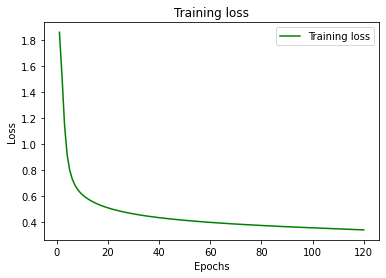
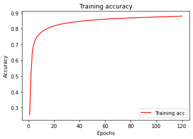

# Keras - Lab

## Introduction

In this lab you'll once again build a neural network, but this time you will be using Keras to do a lot of the heavy lifting.


## Objectives

You will be able to:

- Build a neural network using Keras 
- Evaluate performance of a neural network using Keras 

## Required Packages

We'll start by importing all of the required packages and classes.


```python
import matplotlib.pyplot as plt
import pandas as pd
import numpy as np
import random
from sklearn.model_selection import train_test_split
from keras.utils.np_utils import to_categorical
from sklearn import preprocessing
from keras.preprocessing.text import Tokenizer
from keras import models
from keras import layers
from keras import optimizers
```

## Load the data

In this lab you will be classifying bank complaints available in the `'Bank_complaints.csv'` file. 


```python
# Import data
df = pd.read_csv('Bank_complaints.csv')

# Inspect data
print(df.info())
df.head()
```

    <class 'pandas.core.frame.DataFrame'>
    RangeIndex: 60000 entries, 0 to 59999
    Data columns (total 2 columns):
     #   Column                        Non-Null Count  Dtype 
    ---  ------                        --------------  ----- 
     0   Product                       60000 non-null  object
     1   Consumer complaint narrative  60000 non-null  object
    dtypes: object(2)
    memory usage: 937.6+ KB
    None


<div>
<style scoped>
    .dataframe tbody tr th:only-of-type {
        vertical-align: middle;
    }

    .dataframe tbody tr th {
        vertical-align: top;
    }

    .dataframe thead th {
        text-align: right;
    }
</style>
<table border="1" class="dataframe">
  <thead>
    <tr style="text-align: right;">
      <th></th>
      <th>Product</th>
      <th>Consumer complaint narrative</th>
    </tr>
  </thead>
  <tbody>
    <tr>
      <th>0</th>
      <td>Student loan</td>
      <td>In XX/XX/XXXX I filled out the Fedlaon applica...</td>
    </tr>
    <tr>
      <th>1</th>
      <td>Student loan</td>
      <td>I am being contacted by a debt collector for p...</td>
    </tr>
    <tr>
      <th>2</th>
      <td>Student loan</td>
      <td>I cosigned XXXX student loans at SallieMae for...</td>
    </tr>
    <tr>
      <th>3</th>
      <td>Student loan</td>
      <td>Navient has sytematically and illegally failed...</td>
    </tr>
    <tr>
      <th>4</th>
      <td>Student loan</td>
      <td>My wife became eligible for XXXX Loan Forgiven...</td>
    </tr>
  </tbody>
</table>
</div>


As mentioned earlier, your task is to categorize banking complaints into various predefined categories. Preview what these categories are and what percent of the complaints each accounts for. 


```python
df['Product'].value_counts(normalize=True)
```


    Student loan                   0.190067
    Credit card                    0.159000
    Consumer Loan                  0.157900
    Mortgage                       0.138867
    Bank account or service        0.138483
    Credit reporting               0.114400
    Checking or savings account    0.101283
    Name: Product, dtype: float64


## Preprocessing

Before we build our neural network, we need to do several preprocessing steps. First, we will create word vector counts (a bag of words type representation) of our complaints text. Next, we will change the category labels to integers. Finally, we will perform our usual train-test split before building and training our neural network using Keras. With that, let's start munging our data! 

## One-hot encoding of the complaints

Our first step again is to transform our textual data into a numerical representation. As we saw in some of our previous lessons on NLP, there are many ways to do this. Here, we'll use the `Tokenizer()` class from the `preprocessing.text` sub-module of the Keras package.   

As with our previous work using NLTK, this will transform our text complaints into word vectors. (Note that the method of creating a vector is different from our previous work with NLTK; as you'll see, word order will be preserved as opposed to a bag of words representation). In the below code, we'll only keep the 2,000 most common words and use one-hot encoding. 


```python
# As a quick preliminary, briefly review the docstring for keras.preprocessing.text.Tokenizer
Tokenizer?
```


```python
# ⏰ This cell may take about thirty seconds to run

# Raw text complaints
complaints = df['Consumer complaint narrative'] 

# Initialize a tokenizer 
tokenizer = Tokenizer(num_words=2000) 

# Fit it to the complaints
tokenizer.fit_on_texts(complaints) 

# Generate sequences
sequences = tokenizer.texts_to_sequences(complaints) 
print('sequences type:', type(sequences))

# Similar to sequences, but returns a numpy array
one_hot_results= tokenizer.texts_to_matrix(complaints, mode='binary') 
print('one_hot_results type:', type(one_hot_results))

# Useful if we wish to decode (more explanation below)
word_index = tokenizer.word_index 

# Tokens are the number of unique words across the corpus
print('Found %s unique tokens.' % len(word_index)) 

# Our coded data
print('Dimensions of our coded results:', np.shape(one_hot_results)) 
```

    sequences type: <class 'list'>
    one_hot_results type: <class 'numpy.ndarray'>
    Found 50110 unique tokens.
    Dimensions of our coded results: (60000, 2000)


## Decoding Word Vectors 

As a note, you can also decode these vectorized representations of the reviews. The `word_index` variable, defined above, stores the mapping from the label number to the actual word. Somewhat tediously, we can turn this dictionary inside out and map it back to our word vectors, giving us roughly the original complaint back. (As you'll see, the text won't be identical as we limited ourselves to top 2000 words.)

## Python Review / Mini Challenge

While a bit tangential to our main topic of interest, we need to reverse our current dictionary `word_index` which maps words from our corpus to integers. In decoding our `one_hot_results`, we will need to create a dictionary of these integers to the original words. Below, take the `word_index` dictionary object and change the orientation so that the values are keys and the keys values. In other words, you are transforming something of the form {A:1, B:2, C:3} to {1:A, 2:B, 3:C}. 


```python
reverse_index = dict([(value, key) for (key, value) in word_index.items()])
```

## Back to Decoding Our Word Vectors...


```python
comment_idx_to_preview = 19
print('Original complaint text:')
print(complaints[comment_idx_to_preview])
print('\n\n')

#The reverse_index cell block above must be complete in order for this cell block to successively execute.
decoded_review = ' '.join([reverse_index.get(i) for i in sequences[comment_idx_to_preview]])
print('Decoded review from Tokenizer:')
print(decoded_review)
```

    Original complaint text:
    I have already filed several complaints about AES/PHEAA. I was notified by a XXXX XXXX let @ XXXX, who pretended to be from your office, he said he was from CFPB. I found out this morning he is n't from your office, but is actually works at XXXX. 
    
    This has wasted weeks of my time. They AES/PHEAA confirmed and admitted ( see attached transcript of XXXX, conversation at XXXX ( XXXX ) with XXXX that proves they verified the loans are not mine ) the student loans they had XXXX, and collected on, and reported negate credit reporting in my name are in fact, not mine. 
    They conclued their investigation on XXXX admitting they made a mistake and have my name on soneone elses loans. I these XXXX loans total {$10000.00}, original amount. My XXXX loans I got was total {$3500.00}. We proved by providing AES/PHEAA, this with my original promissary notes I located recently, the XXXX of my college provided AES/PHEAA with their original shoeinf amounts of my XXXX loans which show different dates and amounts, the dates and amounts are not even close to matching these loans they have in my name, The original lender, XXXX XXXX Bank notifying AES/PHEAA, they never issued me a student loan, and original Loan Guarantor, XXXX, notifying AES/PHEAA, they never were guarantor of my loans. 
    
    XXXX straight forward. But today, this person, XXXX XXXX, told me they know these loans are not mine, and they refuse to remove my name off these XXXX loan 's and correct their mistake, essentially forcing me to pay these loans off, bucause in XXXX they sold the loans to XXXX loans. 
    
    This is absurd, first protruding to be this office, and then refusing to correct their mistake. 
    
    Please for the love of XXXX will soneone from your office call me at XXXX, today. I am a XXXX vet and they are knowingly discriminating against me. 
    Pretending to be you.
    
    
    
    Decoded review from Tokenizer:
    i have already filed several complaints about aes i was notified by a xxxx xxxx let xxxx who to be from your office he said he was from cfpb i found out this morning he is n't from your office but is actually works at xxxx this has weeks of my time they aes confirmed and admitted see attached of xxxx conversation at xxxx xxxx with xxxx that they verified the loans are not mine the student loans they had xxxx and on and reported credit reporting in my name are in fact not mine they their investigation on xxxx they made a mistake and have my name on loans i these xxxx loans total 10000 00 original amount my xxxx loans i got was total 00 we by providing aes this with my original notes i located recently the xxxx of my college provided aes with their original amounts of my xxxx loans which show different dates and amounts the dates and amounts are not even close to these loans they have in my name the original lender xxxx xxxx bank notifying aes they never issued me a student loan and original loan xxxx notifying aes they never were of my loans xxxx forward but today this person xxxx xxxx told me they know these loans are not mine and they refuse to remove my name off these xxxx loan 's and correct their mistake essentially me to pay these loans off in xxxx they sold the loans to xxxx loans this is first to be this office and then refusing to correct their mistake please for the of xxxx will from your office call me at xxxx today i am a xxxx and they are against me to be you


## Convert the Products to Numerical Categories

On to step two of our preprocessing: converting our descriptive categories into integers.


```python
product = df['Product']

# Initialize
le = preprocessing.LabelEncoder() 
le.fit(product)
print('Original class labels:')
print(list(le.classes_))
print('\n')
product_cat = le.transform(product)  

# If you wish to retrieve the original descriptive labels post production
# list(le.inverse_transform([0, 1, 3, 3, 0, 6, 4])) 

print('New product labels:')
print(product_cat)
print('\n')

# Each row will be all zeros except for the category for that observation 
print('One hot labels; 7 binary columns, one for each of the categories.') 
product_onehot = to_categorical(product_cat)
print(product_onehot)
print('\n')

print('One hot labels shape:')
print(np.shape(product_onehot))
```

    Original class labels:
    ['Bank account or service', 'Checking or savings account', 'Consumer Loan', 'Credit card', 'Credit reporting', 'Mortgage', 'Student loan']
    
    
    New product labels:
    [6 6 6 ... 4 4 4]
    
    
    One hot labels; 7 binary columns, one for each of the categories.
    [[0. 0. 0. ... 0. 0. 1.]
     [0. 0. 0. ... 0. 0. 1.]
     [0. 0. 0. ... 0. 0. 1.]
     ...
     [0. 0. 0. ... 1. 0. 0.]
     [0. 0. 0. ... 1. 0. 0.]
     [0. 0. 0. ... 1. 0. 0.]]
    
    
    One hot labels shape:
    (60000, 7)


## Train-test split

Now for our final preprocessing step: the usual train-test split. 


```python
random.seed(123)
test_index = random.sample(range(1,10000), 1500)

test = one_hot_results[test_index]
train = np.delete(one_hot_results, test_index, 0)

label_test = product_onehot[test_index]
label_train = np.delete(product_onehot, test_index, 0)

print('Test label shape:', np.shape(label_test))
print('Train label shape:', np.shape(label_train))
print('Test shape:', np.shape(test))
print('Train shape:', np.shape(train))
```

    Test label shape: (1500, 7)
    Train label shape: (58500, 7)
    Test shape: (1500, 2000)
    Train shape: (58500, 2000)


## Building the network

Let's build a fully connected (Dense) layer network with relu activation in Keras. You can do this using: `Dense(16, activation='relu')`. 

In this example, use two hidden layers with 50 units in the first layer and 25 in the second, both with a `'relu'` activation function. Because we are dealing with a multiclass problem (classifying the complaints into 7 categories), we use a use a `'softmax'` classifier in order to output 7 class probabilities per case.  


```python
# Initialize a sequential model
model = models.Sequential()

# Two layers with relu activation
model.add(layers.Dense(50, activation='relu', input_shape=(2000,)))
model.add(layers.Dense(25, activation='relu'))

# One layer with softmax activation 
model.add(layers.Dense(7, activation='softmax'))
```

## Compiling the model

Now, compile the model! This time, use `'categorical_crossentropy'` as the loss function and stochastic gradient descent, `'SGD'` as the optimizer. As in the previous lesson, include the accuracy as a metric.


```python
# Compile the model
model.compile(optimizer='SGD',
              loss='categorical_crossentropy',
              metrics=['acc'])
```

## Training the model

In the compiler, you'll be passing the optimizer (SGD = stochastic gradient descent), loss function, and metrics. Train the model for 120 epochs in mini-batches of 256 samples.

_Note:_ ⏰ _Your code may take about one to two minutes to run._


```python
# Train the model 
history = model.fit(train,
                    label_train,
                    epochs=120,
                    batch_size=256)
```

    Epoch 1/120
    229/229 [==============================] - 0s 2ms/step - loss: 1.8628 - acc: 0.2539
    Epoch 2/120
    229/229 [==============================] - 0s 2ms/step - loss: 1.5305 - acc: 0.5124
    Epoch 3/120
    229/229 [==============================] - 0s 2ms/step - loss: 1.1460 - acc: 0.6468
    Epoch 4/120
    229/229 [==============================] - 0s 2ms/step - loss: 0.9203 - acc: 0.6962
    Epoch 5/120
    229/229 [==============================] - 0s 2ms/step - loss: 0.8002 - acc: 0.7222
    Epoch 6/120
    229/229 [==============================] - 0s 2ms/step - loss: 0.7302 - acc: 0.7406
    Epoch 7/120
    229/229 [==============================] - 0s 2ms/step - loss: 0.6846 - acc: 0.7524
    Epoch 8/120
    229/229 [==============================] - 0s 2ms/step - loss: 0.6524 - acc: 0.7617
    Epoch 9/120
    229/229 [==============================] - 0s 2ms/step - loss: 0.6276 - acc: 0.7689
    Epoch 10/120
    229/229 [==============================] - 0s 2ms/step - loss: 0.6080 - acc: 0.7779
    Epoch 11/120
    229/229 [==============================] - 0s 2ms/step - loss: 0.5914 - acc: 0.7832
    Epoch 12/120
    229/229 [==============================] - 0s 2ms/step - loss: 0.5776 - acc: 0.7887
    Epoch 13/120
    229/229 [==============================] - 0s 2ms/step - loss: 0.5651 - acc: 0.7942
    Epoch 14/120
    229/229 [==============================] - 0s 2ms/step - loss: 0.5542 - acc: 0.7977
    Epoch 15/120
    229/229 [==============================] - 0s 2ms/step - loss: 0.5445 - acc: 0.8020
    Epoch 16/120
    229/229 [==============================] - 0s 2ms/step - loss: 0.5353 - acc: 0.8063
    Epoch 17/120
    229/229 [==============================] - 0s 2ms/step - loss: 0.5274 - acc: 0.8084
    Epoch 18/120
    229/229 [==============================] - 0s 2ms/step - loss: 0.5197 - acc: 0.8120
    Epoch 19/120
    229/229 [==============================] - 0s 2ms/step - loss: 0.5130 - acc: 0.8144
    Epoch 20/120
    229/229 [==============================] - 0s 2ms/step - loss: 0.5065 - acc: 0.8175
    Epoch 21/120
    229/229 [==============================] - 0s 2ms/step - loss: 0.5005 - acc: 0.8205
    Epoch 22/120
    229/229 [==============================] - 0s 2ms/step - loss: 0.4947 - acc: 0.8222
    Epoch 23/120
    229/229 [==============================] - 0s 2ms/step - loss: 0.4896 - acc: 0.8242
    Epoch 24/120
    229/229 [==============================] - 0s 2ms/step - loss: 0.4848 - acc: 0.8262
    Epoch 25/120
    229/229 [==============================] - 0s 2ms/step - loss: 0.4801 - acc: 0.8285
    Epoch 26/120
    229/229 [==============================] - 0s 2ms/step - loss: 0.4757 - acc: 0.8297
    Epoch 27/120
    229/229 [==============================] - 0s 2ms/step - loss: 0.4715 - acc: 0.8317
    Epoch 28/120
    229/229 [==============================] - 0s 2ms/step - loss: 0.4677 - acc: 0.8324
    Epoch 29/120
    229/229 [==============================] - 0s 2ms/step - loss: 0.4636 - acc: 0.8337
    Epoch 30/120
    229/229 [==============================] - 0s 2ms/step - loss: 0.4601 - acc: 0.8359
    Epoch 31/120
    229/229 [==============================] - 0s 2ms/step - loss: 0.4565 - acc: 0.8376
    Epoch 32/120
    229/229 [==============================] - 0s 2ms/step - loss: 0.4533 - acc: 0.8378
    Epoch 33/120
    229/229 [==============================] - 0s 2ms/step - loss: 0.4499 - acc: 0.8389
    Epoch 34/120
    229/229 [==============================] - 0s 2ms/step - loss: 0.4470 - acc: 0.8411
    Epoch 35/120
    229/229 [==============================] - 0s 2ms/step - loss: 0.4441 - acc: 0.8421
    Epoch 36/120
    229/229 [==============================] - 0s 2ms/step - loss: 0.4413 - acc: 0.8433
    Epoch 37/120
    229/229 [==============================] - 0s 2ms/step - loss: 0.4386 - acc: 0.8440
    Epoch 38/120
    229/229 [==============================] - 0s 2ms/step - loss: 0.4361 - acc: 0.8450
    Epoch 39/120
    229/229 [==============================] - 0s 2ms/step - loss: 0.4335 - acc: 0.8456
    Epoch 40/120
    229/229 [==============================] - 0s 2ms/step - loss: 0.4309 - acc: 0.8466
    Epoch 41/120
    229/229 [==============================] - 0s 2ms/step - loss: 0.4288 - acc: 0.8476
    Epoch 42/120
    229/229 [==============================] - 0s 2ms/step - loss: 0.4264 - acc: 0.8491
    Epoch 43/120
    229/229 [==============================] - 0s 2ms/step - loss: 0.4242 - acc: 0.8493
    Epoch 44/120
    229/229 [==============================] - 0s 2ms/step - loss: 0.4221 - acc: 0.8506
    Epoch 45/120
    229/229 [==============================] - 0s 2ms/step - loss: 0.4199 - acc: 0.8509
    Epoch 46/120
    229/229 [==============================] - 0s 2ms/step - loss: 0.4181 - acc: 0.8512
    Epoch 47/120
    229/229 [==============================] - 0s 2ms/step - loss: 0.4161 - acc: 0.8525
    Epoch 48/120
    229/229 [==============================] - 0s 2ms/step - loss: 0.4142 - acc: 0.8541
    Epoch 49/120
    229/229 [==============================] - 0s 2ms/step - loss: 0.4122 - acc: 0.8539
    Epoch 50/120
    229/229 [==============================] - 0s 2ms/step - loss: 0.4105 - acc: 0.8547
    Epoch 51/120
    229/229 [==============================] - 0s 2ms/step - loss: 0.4086 - acc: 0.8551
    Epoch 52/120
    229/229 [==============================] - 0s 2ms/step - loss: 0.4072 - acc: 0.8555
    Epoch 53/120
    229/229 [==============================] - 0s 2ms/step - loss: 0.4054 - acc: 0.8566
    Epoch 54/120
    229/229 [==============================] - 0s 2ms/step - loss: 0.4038 - acc: 0.8571A: 0s - loss: 0.4027 - acc: 0.8
    Epoch 55/120
    229/229 [==============================] - 0s 2ms/step - loss: 0.4022 - acc: 0.8569
    Epoch 56/120
    229/229 [==============================] - 0s 2ms/step - loss: 0.4006 - acc: 0.8585
    Epoch 57/120
    229/229 [==============================] - 0s 2ms/step - loss: 0.3993 - acc: 0.8592
    Epoch 58/120
    229/229 [==============================] - 0s 2ms/step - loss: 0.3974 - acc: 0.8592
    Epoch 59/120
    229/229 [==============================] - 0s 2ms/step - loss: 0.3959 - acc: 0.8597
    Epoch 60/120
    229/229 [==============================] - 0s 2ms/step - loss: 0.3944 - acc: 0.8603
    Epoch 61/120
    229/229 [==============================] - 0s 2ms/step - loss: 0.3934 - acc: 0.8605
    Epoch 62/120
    229/229 [==============================] - 0s 2ms/step - loss: 0.3919 - acc: 0.8620A: 0s - loss: 0.3938 - acc: 0.86
    Epoch 63/120
    229/229 [==============================] - 0s 2ms/step - loss: 0.3908 - acc: 0.8614
    Epoch 64/120
    229/229 [==============================] - 0s 2ms/step - loss: 0.3892 - acc: 0.8622
    Epoch 65/120
    229/229 [==============================] - 0s 2ms/step - loss: 0.3880 - acc: 0.8626
    Epoch 66/120
    229/229 [==============================] - 0s 2ms/step - loss: 0.3867 - acc: 0.8632
    Epoch 67/120
    229/229 [==============================] - 0s 2ms/step - loss: 0.3852 - acc: 0.8629
    Epoch 68/120
    229/229 [==============================] - 0s 2ms/step - loss: 0.3840 - acc: 0.8633
    Epoch 69/120
    229/229 [==============================] - 0s 2ms/step - loss: 0.3827 - acc: 0.8642
    Epoch 70/120
    229/229 [==============================] - 0s 2ms/step - loss: 0.3816 - acc: 0.8647
    Epoch 71/120
    229/229 [==============================] - 0s 2ms/step - loss: 0.3806 - acc: 0.8648
    Epoch 72/120
    229/229 [==============================] - 0s 2ms/step - loss: 0.3794 - acc: 0.8649
    Epoch 73/120
    229/229 [==============================] - 0s 2ms/step - loss: 0.3781 - acc: 0.8659
    Epoch 74/120
    229/229 [==============================] - 0s 2ms/step - loss: 0.3771 - acc: 0.8662
    Epoch 75/120
    229/229 [==============================] - 0s 2ms/step - loss: 0.3760 - acc: 0.8661
    Epoch 76/120
    229/229 [==============================] - 0s 2ms/step - loss: 0.3751 - acc: 0.8663
    Epoch 77/120
    229/229 [==============================] - 0s 2ms/step - loss: 0.3738 - acc: 0.8671
    Epoch 78/120
    229/229 [==============================] - 0s 2ms/step - loss: 0.3727 - acc: 0.8679
    Epoch 79/120
    229/229 [==============================] - 0s 2ms/step - loss: 0.3719 - acc: 0.8677
    Epoch 80/120
    229/229 [==============================] - 0s 2ms/step - loss: 0.3704 - acc: 0.8688
    Epoch 81/120
    229/229 [==============================] - 0s 2ms/step - loss: 0.3696 - acc: 0.8686
    Epoch 82/120
    229/229 [==============================] - 0s 2ms/step - loss: 0.3686 - acc: 0.8692
    Epoch 83/120
    229/229 [==============================] - 0s 2ms/step - loss: 0.3678 - acc: 0.8690
    Epoch 84/120
    229/229 [==============================] - 0s 2ms/step - loss: 0.3668 - acc: 0.8690
    Epoch 85/120
    229/229 [==============================] - 0s 2ms/step - loss: 0.3663 - acc: 0.8699
    Epoch 86/120
    229/229 [==============================] - 0s 2ms/step - loss: 0.3647 - acc: 0.8712
    Epoch 87/120
    229/229 [==============================] - 0s 2ms/step - loss: 0.3636 - acc: 0.8705
    Epoch 88/120
    229/229 [==============================] - 0s 2ms/step - loss: 0.3627 - acc: 0.8708
    Epoch 89/120
    229/229 [==============================] - 0s 2ms/step - loss: 0.3620 - acc: 0.8718
    Epoch 90/120
    229/229 [==============================] - 0s 2ms/step - loss: 0.3608 - acc: 0.8719
    Epoch 91/120
    229/229 [==============================] - 0s 2ms/step - loss: 0.3604 - acc: 0.8718
    Epoch 92/120
    229/229 [==============================] - 0s 2ms/step - loss: 0.3597 - acc: 0.8722
    Epoch 93/120
    229/229 [==============================] - 0s 2ms/step - loss: 0.3587 - acc: 0.8727
    Epoch 94/120
    229/229 [==============================] - 0s 2ms/step - loss: 0.3576 - acc: 0.8731
    Epoch 95/120
    229/229 [==============================] - 0s 2ms/step - loss: 0.3567 - acc: 0.8724
    Epoch 96/120
    229/229 [==============================] - 0s 2ms/step - loss: 0.3557 - acc: 0.8732
    Epoch 97/120
    229/229 [==============================] - 0s 2ms/step - loss: 0.3551 - acc: 0.8738
    Epoch 98/120
    229/229 [==============================] - 0s 2ms/step - loss: 0.3542 - acc: 0.8741
    Epoch 99/120
    229/229 [==============================] - 0s 2ms/step - loss: 0.3536 - acc: 0.8742
    Epoch 100/120
    229/229 [==============================] - 0s 2ms/step - loss: 0.3527 - acc: 0.8744
    Epoch 101/120
    229/229 [==============================] - 0s 2ms/step - loss: 0.3518 - acc: 0.8749
    Epoch 102/120
    229/229 [==============================] - 0s 2ms/step - loss: 0.3513 - acc: 0.8751
    Epoch 103/120
    229/229 [==============================] - 0s 2ms/step - loss: 0.3502 - acc: 0.8745
    Epoch 104/120
    229/229 [==============================] - 0s 2ms/step - loss: 0.3491 - acc: 0.8760
    Epoch 105/120
    229/229 [==============================] - 0s 2ms/step - loss: 0.3484 - acc: 0.8760
    Epoch 106/120
    229/229 [==============================] - 0s 2ms/step - loss: 0.3476 - acc: 0.8756
    Epoch 107/120
    229/229 [==============================] - 0s 2ms/step - loss: 0.3466 - acc: 0.8760
    Epoch 108/120
    229/229 [==============================] - 0s 2ms/step - loss: 0.3460 - acc: 0.8759
    Epoch 109/120
    229/229 [==============================] - 0s 2ms/step - loss: 0.3452 - acc: 0.8761
    Epoch 110/120
    229/229 [==============================] - 0s 2ms/step - loss: 0.3446 - acc: 0.8766
    Epoch 111/120
    229/229 [==============================] - 0s 2ms/step - loss: 0.3436 - acc: 0.8773
    Epoch 112/120
    229/229 [==============================] - 0s 2ms/step - loss: 0.3433 - acc: 0.8773
    Epoch 113/120
    229/229 [==============================] - 0s 2ms/step - loss: 0.3421 - acc: 0.8779
    Epoch 114/120
    229/229 [==============================] - 0s 2ms/step - loss: 0.3412 - acc: 0.8785
    Epoch 115/120
    229/229 [==============================] - 0s 2ms/step - loss: 0.3407 - acc: 0.8784
    Epoch 116/120
    229/229 [==============================] - 0s 2ms/step - loss: 0.3395 - acc: 0.8790
    Epoch 117/120
    229/229 [==============================] - 0s 2ms/step - loss: 0.3389 - acc: 0.8784
    Epoch 118/120
    229/229 [==============================] - 0s 2ms/step - loss: 0.3380 - acc: 0.8790
    Epoch 119/120
    229/229 [==============================] - 0s 2ms/step - loss: 0.3376 - acc: 0.8798
    Epoch 120/120
    229/229 [==============================] - 0s 2ms/step - loss: 0.3364 - acc: 0.8796


Recall that the dictionary `history` has two entries: the loss and the accuracy achieved using the training set.


```python
history_dict = history.history
history_dict.keys()
```


    dict_keys(['loss', 'acc'])


## Plot the results

As you might expect, we'll use our `matplotlib` for graphing. Use the data stored in the `history_dict` above to plot the loss vs epochs and the accuracy vs epochs. 


```python
history_dict = history.history
loss_values = history_dict['loss']

epochs = range(1, len(loss_values) + 1)
plt.plot(epochs, loss_values, 'g', label='Training loss')

plt.title('Training loss')
plt.xlabel('Epochs')
plt.ylabel('Loss')
plt.legend()
plt.show()
```





It seems like we could just keep on going and accuracy would go up!


```python
# Plot the training accuracy vs the number of epochs

acc_values = history_dict['acc'] 

plt.plot(epochs, acc_values, 'r', label='Training acc')
plt.title('Training accuracy')
plt.xlabel('Epochs')
plt.ylabel('Accuracy')
plt.legend()
plt.show()
```





## Make predictions

Finally, it's time to make predictions. Use the relevant method discussed in the previous lesson to output (probability) predictions for the test set.


```python
# Output (probability) predictions for the test set 
y_hat_test = model.predict(test) 
```

## Evaluate Performance

Finally, print the loss and accuracy for both the train and test sets of the final trained model.


```python
# Print the loss and accuracy for the training set 
results_train = model.evaluate(train, label_train)
results_train
```

    1829/1829 [==============================] - 1s 472us/step - loss: 0.3363 - acc: 0.8801


    [0.3362959623336792, 0.8800683617591858]


```python
# Print the loss and accuracy for the test set 
results_test = model.evaluate(test, label_test)
results_test
```

    47/47 [==============================] - 0s 542us/step - loss: 0.2496 - acc: 0.9280


    [0.2496112734079361, 0.9279999732971191]


We can see that the training set results are really good, but the test set results lag behind. We'll talk a little more about this in the next lesson, and discuss how we can get better test set results as well!


## Additional Resources 

- https://github.com/susanli2016/Machine-Learning-with-Python/blob/master/Consumer_complaints.ipynb 
- https://catalog.data.gov/dataset/consumer-complaint-database 

## Summary 

Congratulations! In this lab, you built a neural network thanks to the tools provided by Keras! In upcoming lessons and labs we'll continue to investigate further ideas regarding how to tune and refine these models for increased accuracy and performance.
